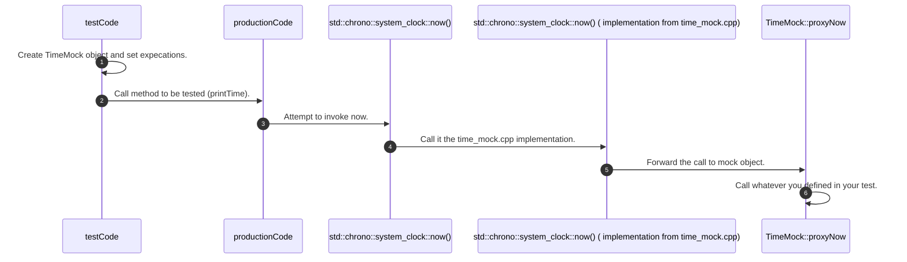

Quick example to help a friend to understand how to mock libraries using gmock 😃

# Motivation

Imagine that your production code use the method `std::chrono::system_lock::now` from `STL`
And you would like to mock this class to address some business requirements such as, increase the code coverage.

In this example I show how you can achieve this using `gmock`.

Before move on with the implementation, here's the "product" structure.

In the folder `production_code`you going find the test that we want to test.

There we have three files:

- target_code.hpp
- target_code.cpp
- main.cpp

The code that we actually want to test is the targat_code.*

They integrate a separate library called by: `production_lib` (for more information, consult the CMake files from each folder).

Inside of this implementation we do a directly call for the method `std::chrono::system_clock::now` and print it output to the user standard output.

```cpp

void printTime()
{
    auto now = chrono::system_clock::now();
    time_t time = chrono::system_clock::to_time_t(now);

    cout << ctime(&time) << "\n";
}
```

The question is, how can I mock it ?

## The answer

To mock this method, we going to create a library called by `time_mock`, this new library will implement the target method `chrono::system_clock::now()` using a gmock proxy redirection call. Whether the method  `chrono::system_clock::now()` would be call, it will call the method `nowProxy` defined in the new class `TimeMock`.

```cpp

std::chrono::system_clock::time_point std::chrono::system_clock::now() noexcept
{
    if(!g_mock)
    {
       return {};
    }
    return g_mock->nowProxy();
}


```

To this work as we expect, we need to define a test program which will describe what the `nowProxy` suppose to do.




## The test program

In this example below, we specify that the method will return a 10 seconds duration. This will make our code return 
a value corresponding to the Unix epoch + 10 seconds.

```cpp
TEST(CallNow, ShouldReturn)
{
    TimeMock time;
    auto duration10Sec = std::chrono::duration<int>(10);
    EXPECT_CALL(time,nowProxy()).WillOnce(Return(std::chrono::system_clock::time_point(duration10Sec)));

    printTime();
}
```

Note the line:

```cpp
 EXPECT_CALL(time,nowProxy()).WillOnce(Return(std::chrono::system_clock::time_point(duration10Sec)));
```

Which describes the return value from the nowProxy called by the `chrono::system_clock::now()` method.

Here in Brazil (GMT-3) it retuns the Unix epoch - 3 hours + 10 seconds:

```
Wed Dec 31 21:00:00 1969
```